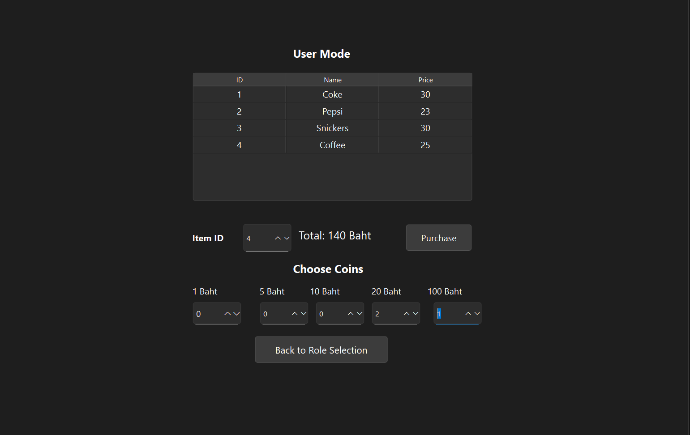
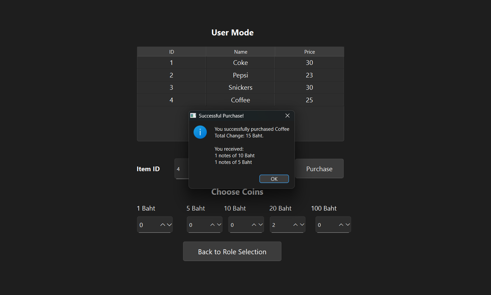
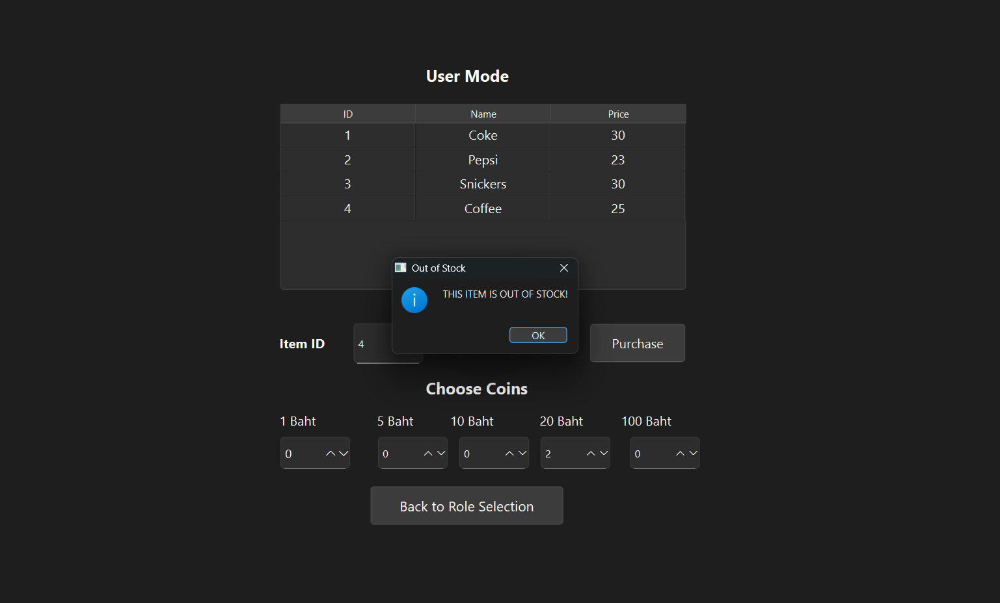
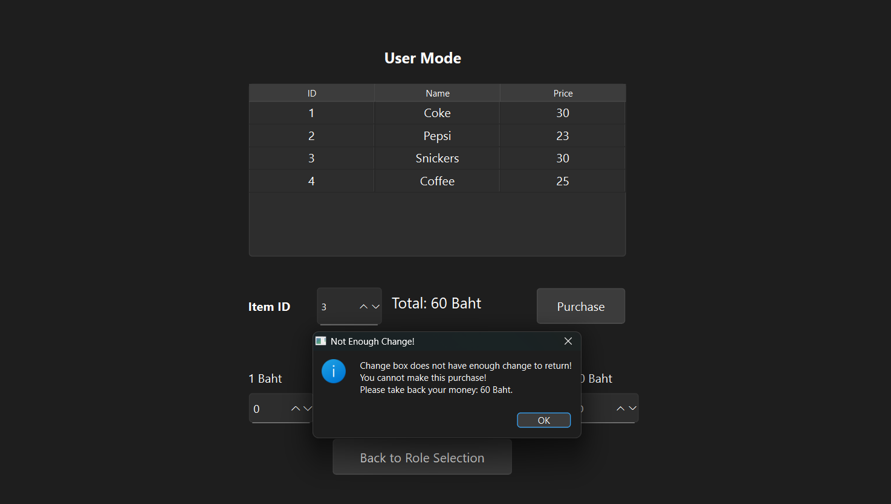
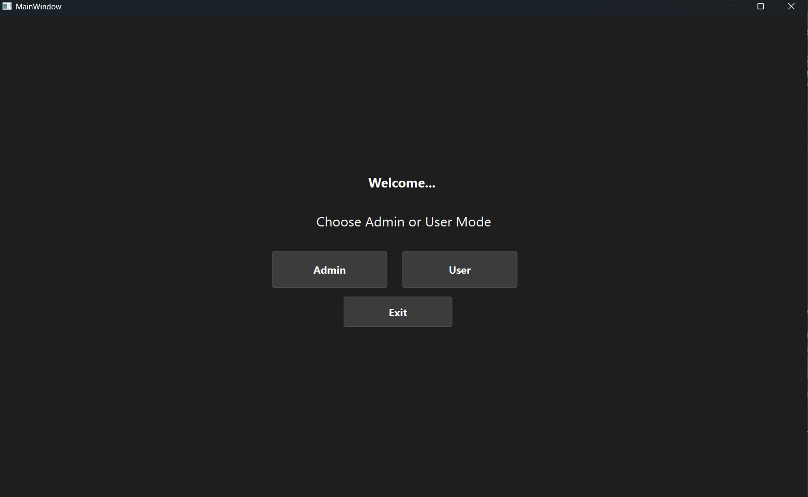
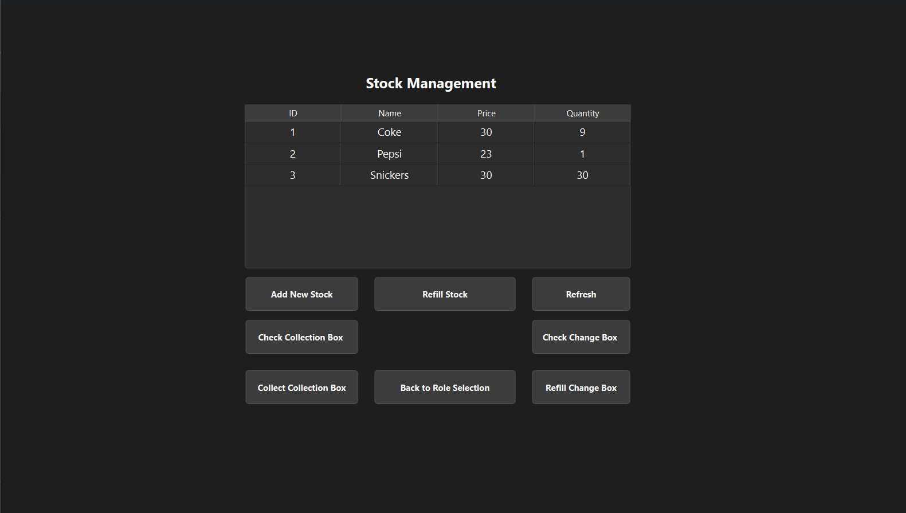
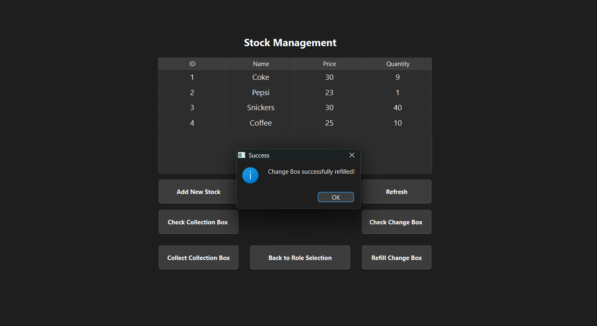
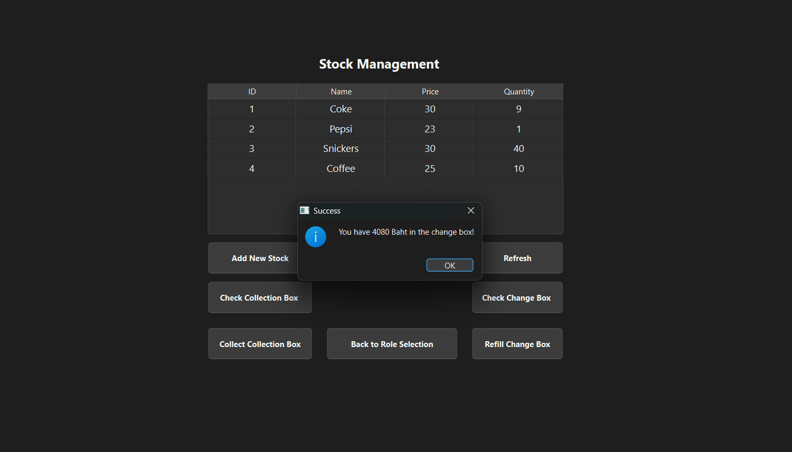

# QT Vending Machine System

This is a C++ GUI Application for Vending Machine Management with User and Admin modes. This project demonstrates SQLite database integration (a popular relational database) and QT which is a cross-platform GUI Framework.

## Screenshots
### User Mode






### Admin Mode








## Features

### User Mode

-   Item Selection: Users can select items using unique selection codes.
-   Payment: Pay using denominations (100 THB, 20 THB, 10 THB, 5 THB, 1 THB).
-   Stock Management: Reduces stock by 1 after each purchase (Need to click Refresh Button).
-   Payment Handling:
    -   Insufficient payment prompts users for additional money.
    -   Returns change upon successful payment.
    -   Out of Stock: Displays "OUT OF STOCK" if an item is unavailable.
-   Stop Operation Conditions:
    -   50% or more product categories are out of stock.
    -   Change box is empty.
    -   Collection box is full.

### Admin Mode:

-   Initial Setup: Set initial stock levels for items.
-   Re-stocking: Refill item stocks as needed by Stock ID.
-   Cash Management:
    -   Check balances in the change box and collection box.
    -   Collect money from the collection box and refill the change box.

## Installation

1.Prerequisites:

- Qt Creator (Latest Version)
- Qt 6.x
- CMake 3.16+

2. Clone the repository:

    ```bash
    git clone https://github.com/SawZiDunn/VendingMachineQt.git
    cd vending-machine
    ```

## Build and Run

1. Open in Qt Creator:

    - Open Qt Creator
    - File -> Open File or Project
    - Navigate to cloned repository and select **CMakeLists.txt**

2. Configure Project:

   - Select appropriate kit (Desktop Qt 6.x)
   - Click "Configure Project"


3. Build & Run:

   - Build: Press Ctrl+B (⌘+B on macOS)
   - Run: Press Ctrl+R (⌘+R on macOS)

4. Follow the prompts:

    - Choose between User Mode or Admin Mode.

    - Perform actions as prompted by the program.
